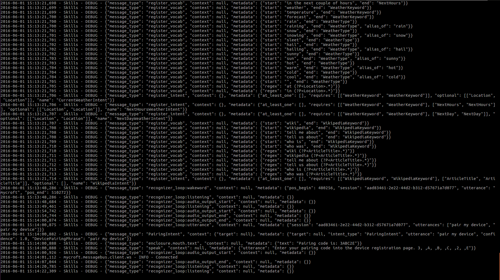
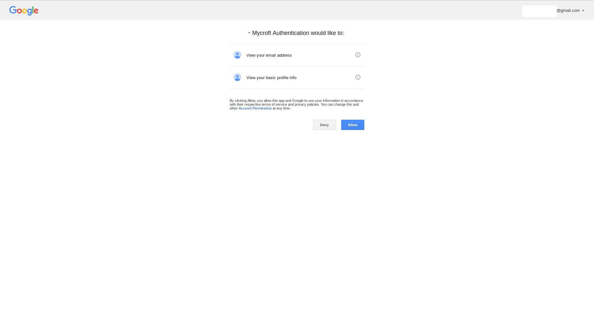
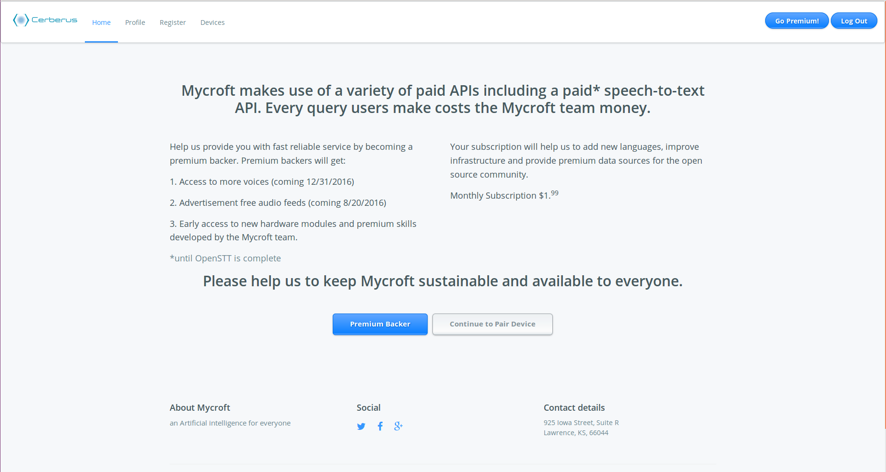
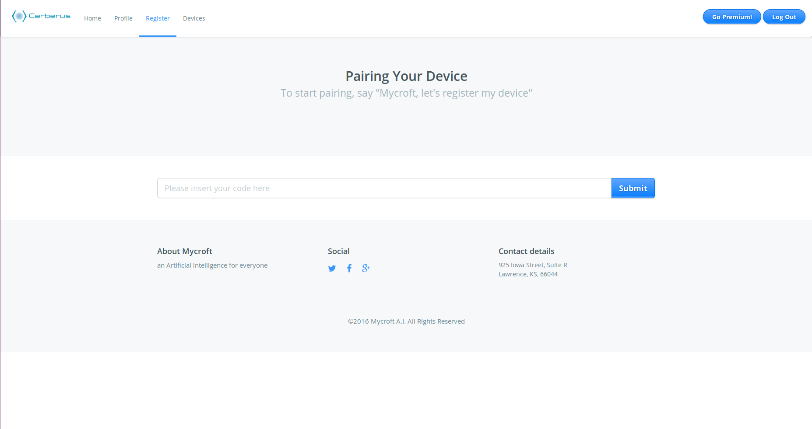
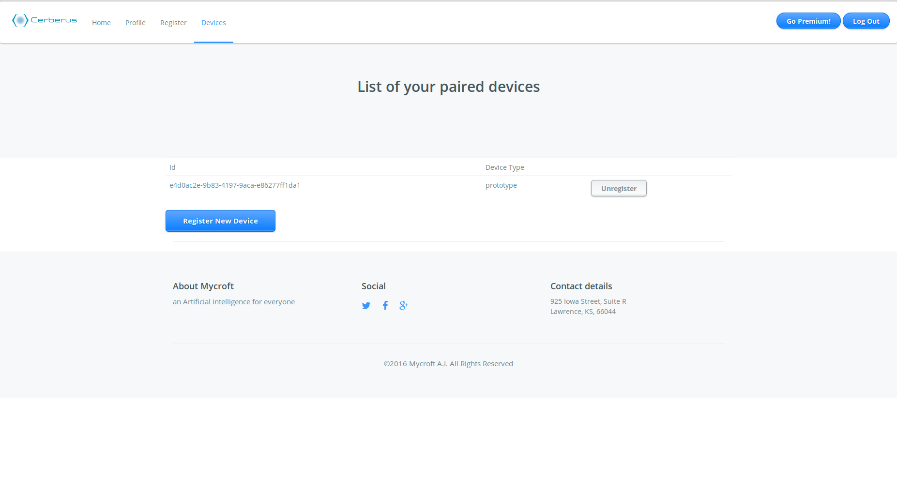

# Getting Started in Ubuntu - Development Environment
 - run `build_host_setup.sh` (installs debian packages with apt-get, please read it)
 - run `dev_setup.sh` (feel free to read it, as well)
 
# Getting Started in other environments

The following packages are required for setting up the development environment,
 and are what is installed by `build_host_setup.sh`

 - `git`
 - `python 2`
 - `python-setuptools`
 - `python-virtualenv`
 - `pygobject`
 - `virtualenvwrapper`
 - `libtool`
 - `libffi`
 - `openssl`
 - `autoconf`
 - `bison`
 - `swig`
 - `glib2.0`
 - `s3cmd`
 - `portaudio19`
 - `mpg123`

 The following packages are required for setting up the development environment on Fedora 23

 - `git`
 - `python 2`
 - `python-setuptools`
 - `python-virtualenv`
 - `pygobject2`
 - `python-virtualenvwrapper`
 - `libtool`
 - `libffi`
 - `openssl`
 - `autoconf`
 - `bison`
 - `swig`
 - `glib2`
 - `s3cmd`
 - `portaudio`
 - `portaudio-devel`
 - `mpg123` (Available in RPMFusion)

# Getting set up using Docker
- <i>WIP: More information coming soon.</i>

## Cerberus Device and Account Manager
Mycroft AI, Inc. - the company behind Mycroft maintains the Cerberus device and account management system. Developers can sign up at https://cerberus.mycroft.ai

By default the Mycroft software is configured to use Cerberus, upon any request such as "Hey Mycroft, what is the weather?", you will be informed that you need to pair and Mycroft will speak a 6-digit code, which you enter into the pairing page on the [Cerberus site](https://cerberus.mycroft.ai).

### Getting the pairing code

First, you need to get the pairing code from Mycroft. To do this, say `Mycroft, register my device`. Listen for what he says or if you are running Mycroft in a terminal, you can look at the terminal running the voice process. You should be able to see what code he says, as shown in the lower right corner of the image above.

### Pairing with Cerberus

Go to cerberus.mycroft.ai and click the `Sign in with Google` link. 
(Note: we are working to support authentication methods other than Google. Stay tuned for those changes and an updated guide for them.)


Select the Google account you want to use with your Cerberus account.


Select Allow on the next page to allow Mycroft access to basic information about your account.


Select Premium Backer on the homepage, or Continue to Pair Device if you do not want to be a premium backer.


Put the pairing code that you got from Mycroft in the first step into the box on this page and click Submit.


Once registered, your Mycroft device should show on your list of paired devices.

Once signed and a device is paired, the unit will use our API keys for services, such as the STT (Speech-to-Text) API. It also uses allows you to use our API keys for weather, Wolfram-Alpha, and various other skills.

Pairing information generated by registering with Cerberus is stored in:

`~./mycroft/identity/identity.json` <b><-- DO NOT SHARE THIS WITH OTHERS!</b>

It's useful to know the location of the identity file when troubleshooting device pairing issues.

## Using Mycroft without Cerberus.
If you do not wish to use our service, you may insert your own API keys into the configuration files listed below in <b>configuration</b>.

The place to insert the API key looks like the following:

`[WeatherSkill]`

`api_key = ""`

Put the relevant key in between the quotes and Mycroft Core should begin to use the key immediately.

### API Key services

- [STT API, Google STT](http://www.chromium.org/developers/how-tos/api-keys)
- [Weather Skill API, OpenWeatherMap](http://openweathermap.org/api)
- [Wolfram-Alpha Skill](http://products.wolframalpha.com/api/)

These are the keys currently in use in Mycroft Core.

## Configuration
Mycroft configuration consists of 3 possible config files.
- `mycroft-core/mycroft/configuration/mycroft.ini`, which lives inside the mycroft codebase/distribution
- `/etc/mycroft/mycroft.ini`
- `$HOME/.mycroft/mycroft.ini`

When the configuration loader starts, it looks in those locations in that order, and loads ALL configuration. Keys that exist in multiple config files will be overridden by the last file to contain that config value. This results in a minimal amount of config being written for a specific device/user, without modifying the distribution files.

# Running Mycroft
## With `start.sh`
Mycroft provides `start.sh` to run a large number of common tasks. This script uses the virtualenv created by
`dev_setup.sh`. The usage statement lists all run targets, but to run a Mycroft stack out of a git checkout, the following processes should be started:
run `./start.sh service`
run `./start.sh skills`
run `./start.sh voice`

*Note: The above scripts are blocking, so each will need to be run in a separate terminal session.*

## Without `start.sh`

Activate your virtualenv.

With virtualenv-wrapper:
```
workon mycroft
```

Without virtualenv-wrapper:
```
source ~/.virtualenvs/mycroft/bin/activate
```
- run `PYTHONPATH=. python client/speech/main.py` # the main speech detection loop, which prints events to stdout and broadcasts them to a message bus
- run `PYTHONPATH=. python client/messagebus/service/main.py` # the main message bus, implemented via web sockets
- run `PYTHONPATH=. python client/skills/main.py` # main skills executable, loads all skills under skills dir

*Note: The above scripts are blocking, so each will need to be run in a separate terminal session. Each terminal session will require that the virtualenv be activated. There are very few reasons to use this method.*

# FAQ/Common Errors

#### When running mycroft, I get the error `mycroft.messagebus.client.ws - ERROR - Exception("Uncaught 'error' event.",)`

This means that you are not running the `./start.sh service` process. In order to fully run Mycroft, you must run `./start.sh service`, `./start.sh skills`, and `./start.sh voice`/`./start.sh cli` all at the same time. This can be done using different terminal windows, or by using the included `./mycroft.sh start`, which runs all three process using `screen`.

